<a name="top"></a>

# SEQUELIZE TUTORIAL FOR BEGINNERS

```JavaScript
const Contributors =
[ { Name: "Richard Lorenzini" }, { Name: "Jaclyn Legacion" } ]
```
<br/>

**THIS IS A WORK IN PROGRESS**

| SEARCH OPTIONS | WHAT IT'S FOR |
| :--- | :--- |
| [DOC#START](#and-so-it-begins) | BEGINNING OF DOCUMENTATION |
| [SQLZ#START](#setting-up) | SETTING UP FROM SCRATCH |
| [SQLZ#NPM](#npm-time) | SEQUELIZE INSTALLATION |
| [SQLZ#DB](#database-setup) | SETTING UP THE DATABASE |
| [SQLZ#MIG](#first-migration) | FIRST MIGRATION |
| [SQLZ#FORMS](#forms-and-posts) | FORMS AND POSTS |
| [SQLZ#SEEDS](#using-seeders) | USING SEEDERS |
| [SQLZ#DISP](#display-data) | DISPLAYING DATA FROM DATABASE |
| [SQLZ#UPD](#user-update) | UPDATE DATABASE DATA |
| [SQLZ#ASSOC](#associations) | ASSOCIATING TABLES AND DATA |
| [SQLZ#OTOM](#one-to-many) | ONE TO MANY ASSOCIATIONS |
| [SQLZ#OTOO](#one-to-one) | ONE TO ONE ASSOCIATIONS |
| [SQLZ#MTOM](#many-to-many) | MANY TO MANY ASSOCIATIONS |

<br/>
<br/>
<br/>

<a name="and-so-it-begins"></a>

<a href="#top">`back to top`</a>

## So what is Sequelize?

**Sequelize** is a tool used to make the connection between your *backend* and your *database* simpler, specifically when working with **multiple developers with different SQL backgrounds**. For example, if one developer has coded in mySQL, another in SQLite, and a third in postgreSQL, all developers will be able to use a **single query syntax**. In either small or large applications this can be beneficial. Setting up Sequelize and understanding what's going on can be daunting, so I hope this simple and basic tutorial helps anyone who reads it.
<br/>
<br/>
This tutorial is **VERY BASIC** and will not go into great depth about every aspect of Sequelize. Also, I use certain tools to help me out when coding, which others may or may not be aware of. Below, I list the tools I use and a basic description of what I use them for.

| TOOL | PURPOSE |
| :-- | :-- |
| Postico | Visualizes your database |
| Postman | Debug and test fetch calls |
| ElephantSQL | Online hosting service for databases |
| ATOM | My preferred code editor |

<br/>
<br/>

---

<br/>


<a name="setting-up"></a>

<a href="#top">`back to top`</a>


I have created a new folder called `mySequelize` and opened a terminal at that folder.

My terminal is displaying the following, indicating I am on my Macbook Pro, in the folder `mySequelize`, as user: richardlorenzini.

```console
(base) Richards-MBP:mySequelize richardlorenzini$
```

## Setting Up Git


```console
git init
```

We will begin by initializing our git folder and connecting to this git repository.


```console
git add remote origin <insert_repository_url_here>
```


```console
touch .gitignore
```

.gitignore is used to tell your git commands to ignore certain folders. This is extremely useful when working in a Node.js environment, as your Node_Modules folder (the packages installed into your project) can get massive quickly.


My .gitignore file can be located in my GitHub repository <a href='https://github.com/rlorenzini/usingGitignore/blob/master/.gitignore'>HERE</a>. This is a cookie-cutter catch-all .gitignore file.


```console
git add . && git commit -m "first commit" && git push origin master
```

I always perform an initial commit to verify I have properly setup my git environment.

<br/>
<br/>

---

<br/>

<a name="npm-time">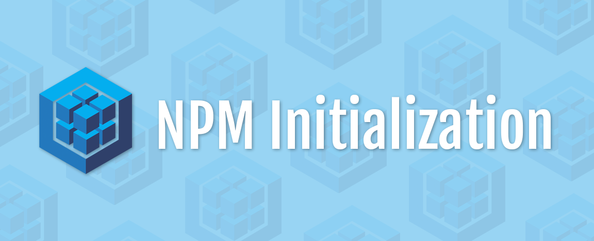</a>


<a href="#top">`back to top`</a>


```console
npm init && npm install express && npm install cors && npm install body-parser && npm install sequelize && npm install sequelize pg
```
Don't forget to initialize node in your project with ```npm init```. Otherwise, you can't install or use any packages.

I install **express** to make my time coding my backend simpler, **cors** is to avoid certain HTTP request issues, **body-parser** allows us to translate what is being sent from the frontend to the backend, **sequelize** is the point of this tutorial and makes the transfer of data from the backend to our database simpler, and **sequelize pg** is used to tell sequelize we are using a *postgres database*.


```console
npm install -g sequelize-cli
```

Sequelize does not, by default, have a command-line interface. **Sequelize CLI** stands for "Sequelize Command-Line Interface". We are installing this so we can avoid a lot of the file creating and editing Sequelize performs. This also makes migrations easier.


Setting up our backend **app.js** environment. What we installed, we are requiring.

**NOTE:**
```console
models = require(./models)
```
is so we can tell Sequelize where the models are. More on that later.


<br/>
<br/>

---

<br/>

<a name="database-setup">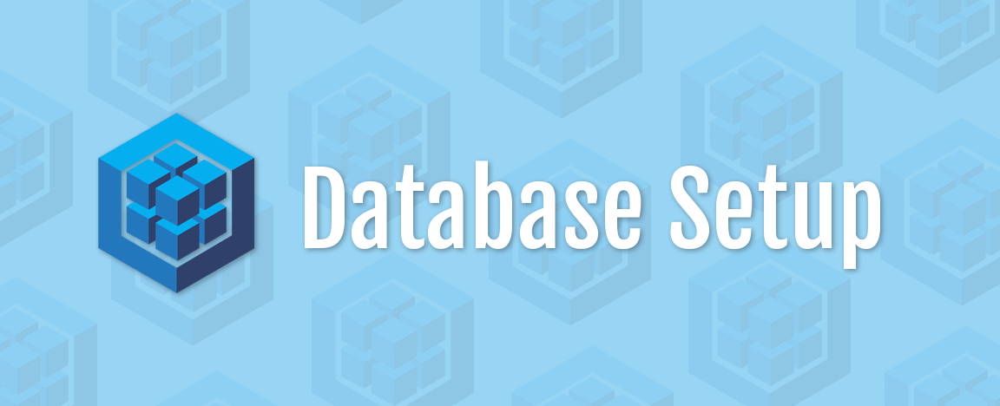</a>


<a href="#top">`back to top`</a>

In your command-line, which should be in your directory for your backend (the folder which has **app.js**), run the following command.

```console
sequelize init
```

We have now initialize Sequelize. If you receive an error message informing you Sequelize is not a command, you did not properly install the Sequelize-CLI.

Sequelize will create several folders inside of your working directory: models; seeders; migrations; config. At this point, running
```console
sequelize db:migrate
```
can help avoid any early-stage issues, but is not required.

| FOLDER | QUICK EXPLANATION |
| :--- | :--- |
| MODELS | A visual representation of each table in your database. Does not always update with migration. |
| MIGRATIONS | JavaScript files which execute during migration. These files are the backbone of Sequelize. |
| SEEDERS | Used to dump data into a table. DO NOT USE in place of forms, post, and create/build. |
| SEEDERS | Seeders should not be used until you have a basic understanding of Sequelize and databases. |
| CONFIG | The config file in this folder tells Sequelize what database you are using and where it is located. |


The config file will very likely need modified from the beginning of your project. For example, unless your database is a MySQL database, you will need to change your dialect. In our case, we are going to change the dialect to **postgres** since we are using a postgres database.

I prefer to setup a database on a website called **ElephantSQL**. It is a free online service to host a database and store the data. ElephantSQL **DOES NOT** replace Postico and **DOES NOT** show you the tables, columns, and data inside of your database.


ElephantSQL provides us several pieces of information, which is automatically generated when we create our database. What we are interested in is **Server, User & Database, and Password**.

| INFOMATION | DESCRIPTION |
| :--- | :--- |
| **SERVER** | The URL our database will be hosted on. A local environment runs a database on PORT 5432 by default. |
| **USER/DATABASE** | When we go to our server, this is our username and the database name we are looking for. |
| **PASSWORD** | The password we need to access the DATABASE via our USER. |


The placement of the information into postico and your config file are straight forward.

SERVER goes into "host", USER & DATABASE goes into "username"/USER and "database", and PASSWORD goes into "password".


<br/>
<br/>

---

<br/>

<a name="first-migration"></a>


<a href="#top">`back to top`</a>


Once we connect into our database via Postico, we can see all of our tables, columns, and data is a clean interface. Our Postico database is practically empty at this stage, as we have no created any tables.


```console
sequelize model:create --name Users --attributes 'username:string, password:string, firstName:string, lastName:string, email:string'
```

We are finally creating our first **TABLE**. A *table* in Sequelize is referred to as a **MODEL** and *columns* are **ATTRIBUTES**. Our
```console
model:create
```
command takes in a name and attributes. The name must be declared as
```console
--name NameOfYourTable
```
. You **MUST** declare --name or the command will fail. Columns are immediately declared after the name of the table, and must be declared with --attributes to work. Attributes are wrapped inside of apostrophes as a whole and not individually, so be mindful of your syntax.

```console
--attributes 'FirstColumnName:DATATYPE, SecondColumnName:DATA, etc:etc'
```


Running our model:create command has generated a new migration file. Migration files are JavaScript files with JavaScript code. Essentially, in our migration file above, we are creating a Class via Sequelize. This file is executed when we run
```console
sequelize db:migrate
```
This particular migration file is telling us it will create a table called Users with the attributes id, username, password, firstName, lastName, email, createdAt, and updatedAt. Id, createdAt, and updatedAt are automatically generated by Sequelize.

Our migration file starts with
```console
model.exports
```
which is an object. The first key for our object is UP, and the last key is DOWN. Both UP and DOWN need to be utilized in a specific manner.

| WHAT | WHY |
| :--- | :--- |
| UP | Used to create, modify, or update your database. |
| DOWN | Used to delete, undo, or reverse whatever UP does. |


I'm going to slow down and explain a bit about Sequelize, as to understand db:migrate we must understand how Sequelize functions. Sequelize keeps a log of everything done. Every migration is kept, with a log of when what was ran. This way, if a new user pulls our project and runs our project, Sequelize can build the environment from scratch exactly how you, the original developer, built your project. Due to this, you **must** commit fully to Sequelize. Let me explain.

Imagine following this tutorial and at this point <GO TO JACLYN'S GITHUB FOR THIS INFORMATION> would be great, right? But we really don't talk about that anymore, especially after **the incident**... Anyway. Let's move on to utilizing Sequelize with scrapping data form news websites.


I'm only partially kidding, but this is essentially what happens when you do not commit fully to Sequelize. If you use pg-promise to create a new table, Sequelize will be unable to retrieve that script and build a proper environment. Then, the user who downloaded and ran your project will not have a fully functional environment.

Say you created a Users table in pg-promise. If the user then goes to a *login page* you created and submits their login information, your application will crash due to being unable to communicate properly with the server. Sequelize does not know the Users table exists since it did not create a migration and execute building the Users table. This is why if you plan to use Sequelize it is **HIGHLY** recommended, and almost completely required, to **ONLY** utilize Sequelize.


Looking at our Postico after our db:migrate, we can see our Users table and the columns we specified. **MAGNIFICENT.**

<br/>
<br/>

---

<br/>

<a name="forms-and-posts"></a>

<a href="#top">`back to top`</a>


I built my project in **React**, a framework for **JavaScript** based on Components and Single Page Applications. React is my comfort zone and go-to for building projects, but that is not the only reason I used it for this project. React allows you to break apart the webpage into components and inject them easily wherever they are needed. This way, I do not have to show off my entire project, but I can show off just the raw HTML code used to build the form.

I purposely removed code-wrapping and indentions so the code is easier to follow. Otherwise, my code would either go further than my screen or would be less appealing to look at.

For those who are unfamiliar with React, this is what you need to know about the form shown above. **onClick** is similar in functionality and purpose as **action**. **onChange** is a React thing, so do not get caught up on that too much. I'm using it to make it easier for me to pass my values to my backend via my **fetch** above, **handleSubmitData**.

**Fetch** has two very common uses: **POST and GET**. I your client, who is on the **frontend** of your applications, wants to **get information or a new page**, you have to use a **get request** via fetch. In my example above, our client wants to **submit data to the database**, so we have to allow them to **post their data** to our backend. This is why we are using a **post request** via fetch.

Our header informs our server, the **backend**, what to expect. This is why we installed **body-parser** on the backend, so we can easily pass our data as a **JSON** file. **JSON.stringify()**, which is a JSON function, translates roughly to, "take this data and make it a JSON file." JSON.stringify, as you would expect if you are familiar with JSON files, wants an object. We define our keys and values, where our keys are what our backend calls and our values are directly taken from our form. In my example, **this.state.username** is the value submitted by our user via the **username input**.

**NOTE:** There are many ways to do this step, with many different frameworks and libraries to change how you do it. For example, if you wish to use **AXIOS** to handle your fetch requests your code will look different. Be sure to keep in mind the technologies you are using, as my code may or may not translate properly into your technologies without a bit of fiddling.


Our POST request is console logged on our backend so we can get an idea of what we are receiving from the frontend. When using **body-parser**, the JSON file is sent in the request as **body**. To access the JSON file, we must call **req.body**. Our user, me, sent nothing but "a" in every input.

```JavaScript
console.log(req.body)
```
As we see, we are no longer working with **this.state.username**, but we have all of our values of "a". To get the value on the backend, we now use **req.body.username**. Below, I will list what the frontend sent and what the backend received so we can visualize the change better.

| FRONTEND FORM VALUES | BACKEND JSON FILE |
| :--- | :--- |
| this.state.username | req.body.username |
| this.state.password | req.body.password |
| this.state.firstName | req.body.firstName |
| this.state.lastName | req.body.lastName |
| this.state.email | req.body.email |


Personally, the first thing I do is create variable names for my data being received. Typing out **username** is quicker and takes up less space than typing **req.body.username**. This is a personal preference to shorten and clean-up my code, but is not required.

Line 24 is where we are now in Sequelize territory. We are still working on our backend, but we now must communicate to Sequelize what we want Sequelize to do with our data. As you may recall above, we created a model/table called **"Users"**. Once we migrated, we received a model file called **"users.js"**. This is where Sequelize begins to shine, but you must understand **what you are doing and why**. We required our models earlier, at the very beginning, because Sequelize needs to know **where to find them**. For any coder who has ever created routes, paths, or imported their own files, this concept isn't new but might look different.

Our model === users. When we type ```models```, Sequelize immediately knows two things. First, we are going to be doing something with a model. Secondly, it knows where which models we are going to be working with are. The next argument, ```users```, tells Sequelize, "Check the /models folder for a file called 'users'." The last argument, **build**, is as basic as it comes. Time to build a new model with our data! This is going to be our first Users entry into our database.

**models.Users.build()**

**build()** is a function and our **model** is built similar to a **Class**. Sequelize wants us to pass our data in as an object. Our keys **must** be exactly the same as the **attributes** our model is built with. If my model has an attribute "firstname", I cannot send this key as "firstName". If you run into errors about improperly building a model, this should be the first place you look. It is very easy to use the wrong syntax, especially if your database uses a different convention than your backend.

```JavaScript
{
username: req.body.username,
password: req.body.password,
firstName: req.body.firstName,
lastName: req.body.lastName,
email: req.body.email
}
```
This is how our **build** object would look if we did not define our req.body values as variables. It is not wrong and will work, but my preference is to define variables first.


Postico is now displaying **"a"** values in each of our columns. **NOTE:** Postico does not refresh dynamically as data is put into your database. Remember to refresh to see the results. Our **id** column is, by default, 1 as this is our first entry. Behind my terminal is **createdAt and updatedAt**, which are updated automatically by Sequelize.

Looking at our terminal, we see a long command being run which may be familiar to some of you. The command is run using pg-promise. Sequelize takes our **models.Users.build({})** and translates it into pg-promise for us, so we do not have to execute pg-promise ourselves. As you may recall, by default our config file uses "mysql" as the "dialect". Sequelize can communicate with multiple backend technologies, which is great for us. If we decided to change our server to a mysql server, converting is much easier now as we only need to switch to mysql. The backend, frontend, models, and migrations do not change. We only have to uninstall pg-promise, install mysql, and require mysql. There may be a few other tweaks, but overall this is much faster and simpler than rewriting huge chunks of your code.

<br/>
<br/>

---

<br/>

<a name="using-seeders"></a>


<a href="#top">`back to top`</a>

## What Are Seeders?

To explain the ins and outs of seeders, we first need to go back to the basics of using a database. Why do we use databases? What is the point of a database? **Why would you have an empty database?** A lot of these questions seem rhetorical, but these are common questions teams ask when planning out their application.

**Why do we use databases?**

To store large amounts of data in one spot, which our application is able to access as long as it has a connection (wireless or hardwired) to our database. Remember, a database is just a computer which is set up to store data for an application. Databases are so important and widely used there are warehouses full of only databases called Data Centers.

**What is the point of a database?**

A database holds all our data so our client doesn't have to. Also, we can now manage and regulate the data directly. The point of *your* database can change based on the scope and purpose of your application.

**Why would you have an empty database?**

This question definitely seems pointless, but there are times when a database would be empty. When you launch an application, do you have a pre-defined user base? If you have a log in but no one has registered an account, is your database going to be empty? What if our database is just for holding data which is relevant to our website? For example, what if we are creating a food market database, starting with potatoes, but do not want a userbase?

**Ask yourself: WHAT AM I BUILDING AND WHY?**

This question determines everything you are going to do moving forward, and the more you plan **now** the less you have to adjust in the *future*. Typically. Development can change drastically at times if the scope, scale, and focus of the application changes. If we decided to add a userbase to our food market website, we now need a second table, some form of session control to know when a user is logged into our application, and we have to discuss if we want users to be allowed to favorite foods. Maybe our users are now requesting a list of local food markets and farms. Are we going to allow them to save local locations to their user? Will we include a mapping feature to give them directions to their local markets?

Throughout all of those adjustments, our original potatoes database was never changed. It still only stores information on potatoes. We **might** add a column for our association with the users, *if* we want a favorites feature, but that is another discuss.

## CREATING SEEDERS

For the purpose of my database, I have decided I want a table called **"potatoes"**, which will only hold information on a variety of potatoes. I have also decided I do not want my userbase to be able to manipulate the potatoes table, so I have no reason to create a potato registration feature. If my userbase is not going to add potatoes to the potato table, **why make a page to add potatoes to our database?** This is where **seeders** take over.

A **seeder** is a file full of data which gets planted into our database. With **Sequelize** we must include certain information into our seeder file, or our seeder file will fail to execute. First, let's create our potatoes table. What do people generally look for when it comes to potatoes? The name, the starch level, and the best way to cook them. This is data our userbase will come to us for, so from the beginning we are going to provide it.

```console
sequelize model:create --name potatoes --attributes 'name:string, starch_level:string, cook_method:string'
```

```console
sequelize db:migrate
```

We have created a table called **potatoes** with the columns **id, name, starch_level, cook_method, createdAt, and updatedAt.** The id, createdAt, and updatedAt are automatically created by Sequelize and have the constraint **NOT NULL**. As you may recall, we did not have to enter that information when registering new users. Sequelize automates these values during a table insertion, but we have to do *a little* extra work when using seeders. **DON'T PANIC!** We will figure this out.

**QUICK NOTE:** There are multiple naming conventions used across different languages, frameworks, and libraries. JavaScript commonly use what is called **camelCase**, but this is entirely at the discretion of the developer. For this small tutorial, I'm not concerned about naming conventions. Sequelize's naming convention is to title your tables in the **singular**, ie. *potato* and **not** *potatoes*. Sequelize will check your --name and make the table name the **plural** of your table name. If the --name you give your table is already plural, Sequelize does not make any adjustments. Keep this is mind, as if you use the Sequelize naming conventions certain parts of my tutorial **will need adjusted in your code**.

For example, my models.potatoes.findOne() *should* be models.potato.findOne() **if** I had used proper naming conventions.

On to the code! Let's create a seeder file and plug in our data.

```console
sequelize seed:generate --name potato-data
```

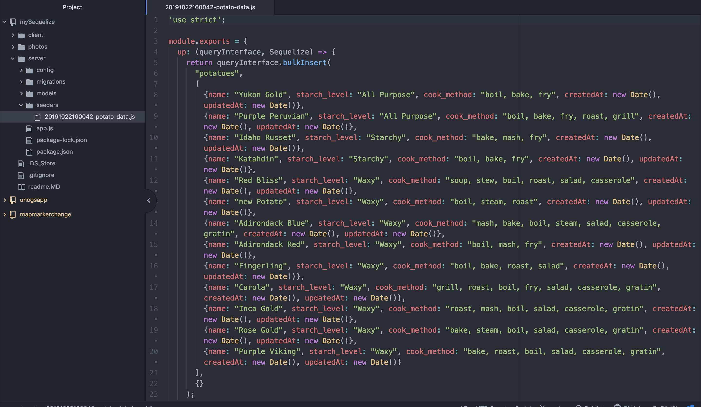

This is my completed **UP** for my seeder file, which has 13 **objects** inside of 1 **array**. Seeders typically only have one of two arguments, being **bulkInsert** and **bulkDelete**. Let's break down why our **UP** is using **bulkInsert** and how to properly use **bulkInsert**.

Again, like with a lot of things, Sequelize automates a lot of stuff for us. The first four lines of our file are automated and we do not pick the variables passed through the function.

```JavaScript
'use strict';

module.exports = {
  up: (queryInterface, Sequelize) => {
```

Just like our migrations, we have **module.exports = {}** to tell Sequelize **"everything in this object is to be used when we migrate"**. Also just like our migrations, there are two primary keys: **UP and DOWN**. These function exactly how they do with migrations. When you run your migration, the **UP** is executed. When you reverse your migrations, the **DOWN** is executed. The only difference is the command we run in our terminal to execute seeders instead of migrations, which is **db:seed** instead of *db:migrate*. (More on this later.)

Our keys, **UP and DOWN**, both have functions as their values. The functions return the result we desire. Since we want to insert a bunch of potatoes into our database, we are going to **bulkInsert** information into our database. Sequelize really picked straight forward function names. **addColumn, removeColumn, bulkInsert, findOne, findAll, build**. This helps keep Sequelize user-friendly, and allows us a better learning experience.

**bulkInsert works as follows:**

```JavaScript
return queryInterface.bulkInsert(
  "name_of_table_we_want_to_manipulate",
  [ {name_of_column_inside_our_our_table: "value_we_want_to_insert_inside_said_column"},
  {createdAt: new Date()},
  {updatedAt: new Date()}
  ], {} );
```
Sequelize is very straight forward, which I have expressed many times. **bulkInsert** takes in the table name and an array. The array can hold many objects, where the keys match the column names. Our keys do not need to be in quotes, but our data in the first object is in quotes because we are passing in a **string**. You must know the **data type** of the column when creating a seeder, or else the seed will fail. We set all of our columns to strings when we created our table initially (recall model:create ..... 'name:**string**, starch_level:**string**.......'). Common data types to be aware of are **strings, integers, floats, booleans, and text.**

Our finished result is...

```JavaScript
  up: (queryInterface, Sequelize) => {
    return queryInterface.bulkInsert(
      "potatoes",
      [{
      name: "Yukon Gold",
      starch_level: "All Purpose",
      cook_method: "boil, bake, fry",
      createdAt: new Date(),
      updatedAt: new Date()
      }]
```

**Why do we have an object for *createdAt and updatedAt* but *not id* when they are all set to *NOT NULL*?**

Very good questions, complete stranger! This is just another Sequelize quirk. Sequelize will **always** handle the first column, **id**, for us, until we tell it otherwise. In our case, there's no reason to change this, so we are letting Sequelize do its thing.

Sequelize, however, does not automate **createdAt and updatedAt** when seeding for... Reasons. It does during insertions, such as when we inserted a new user via our registration, but not during seeding. Luckily, we have a built-in JavaScript function called **Date()** which Sequelize already uses. By setting our value to **new Date()**, we are passing in a time stamp of the moment the seeder is migrated. **Why use *new Date()?*** Because I don't want to type out this:

```2019-10-22 17:37:01.364+00```

This is how the time stamp comes thorugh, and even though it is easy to do ourselves... I just see no reason to.

```JavaScript
{name: "Yukon Gold", starch_level: "All Purpose", cook_method: "boil, bake, fry", createdAt: new Date(), updatedAt: new Date()},
```

This is the first entry of my seeder. As you recall, we created the attributes **name, starch_level, and cook_method** when we ran our **model:create** command. We did not create a constraint of **NOT NULL** on these values, but we decided when we created our table these values were important for our userbase. This is why we have created our object this way. Feel free to experiment and see if and when you can ignore passing values into a column, if you can put the columns out of order, and if you can pass through a limited amount of digits or pass an integer as a string. Or, maybe wait until **after** we create our **DOWN**.


```JavaScript
down: (queryInterface, Sequelize) => {
    return queryInterface.bulkDelete("potatoes", null, {})
  }
```

Well, that was much shorter than the **UP**. Why? Because the **UP** is passing in 13 potato types with name, starch_level, cook_method, createdAt, and updatedAt keys. **DOWN** is just saying "delete everything", but let's get a *little* more technical with that.

**bulkDelete** passes through the table name, which for us is "potatoes", and the value we want to set everything to, **null**. What's that empty object in both our **UP** and **DOWN**? That is for options, which we are not using at this time. This is more useful when using **bulkUpdate** in your seeder.

Now we run our seeder, similar to how we would run our migration.

```console
sequelize db:seed:all
```
And our database is full of data! Success.

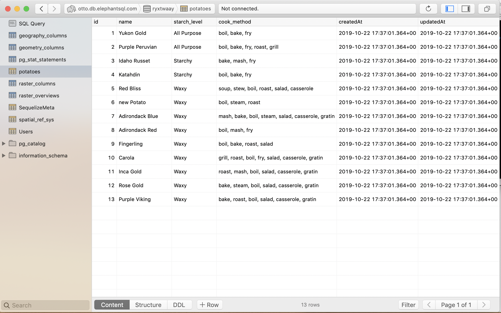

A few seeder commands you may need to know.

```console
sequelize db:seed:undo
```

**db:seed:undo** can pass the same arguments as **db:seed**, with the two most common being **:all** or **--name file-name**.

```console
sequelize db:seed --name file-name
```

If you have multiple seeders and want to run just one, specify the name of the seeder with **--name file-name**.

<br/>
<br/>

---

<br/>

<a name="display-data"></a>

<a href="#top">`back to top`</a>

Our food market website now has a database full of potatoes, but it does our end users no good if they can't see that data. Why go to any website if you can't see or use the data in some way? Reddit without posts, Instagram without pictures, Netflix without movies or shows; your users need to have access to relevant data.

Sequelize has built-in functions for getting data. Some of the most common functions you will use are **findOne(), findAll(), and findByPk()**. **findOne()** is used to return **one result**, **findAll()** is used to return **all results matching our search criteria**, and **findByPk()** is used to find everything related to a certain **primary key**.

We are going to start with **findAll()**.

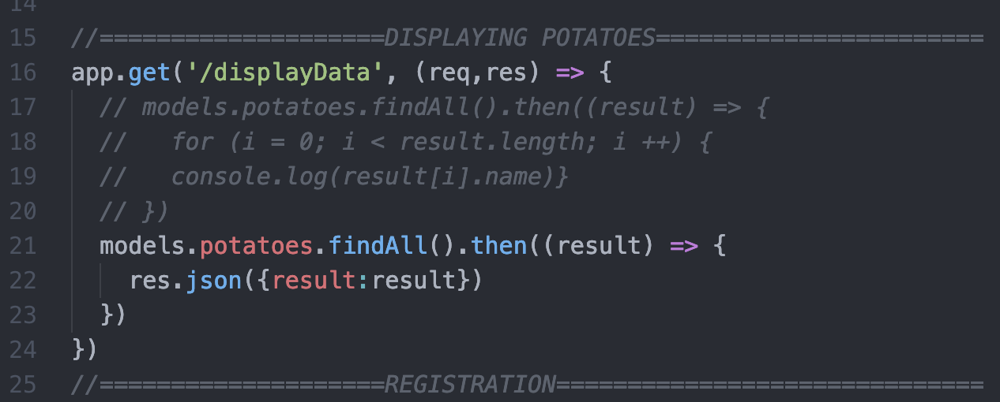

Overall, two lines of code is all we need to get all entries in our **potatoes** table and send them to the front. Like everything else, let's break it down.

```JavaScript
app.get('/displayData', (req,res) => {
  models.potatoes.findAll().then((result) => {
    res.json({result:result})
  })
})
```

**NOTE:** The commented code was a way I tested iterating the data and console logging just the names of the potatoes. I left this in intentionally, so you can test other ways of getting the data.

## Get Requests, Backend

```JavaScript
app.get('/displayData', (req,res) => {
```
We defined **app** in the beginning as our **Express server**, and the client wants to **get** data from us. The **action** associted with the **get request** is **/displayData**. **/displayData** must match the **fetch request** from the frontend, which we will go over shortly. **(req,res)** are our **request and response**, which are two variables. The community as a whole decided on **req and res** to be universal variable names, since they're short and easy to understand.

```JavaScript
models.potatoes.findAll().then((result) => {
```
**models** was **required** in the beginning as well as **require('./models')**, which tells Sequelize where to look for our models. **potatoes** is a model/table, and Sequelize has functions built just for models/tables. **models.potatoes.findAll()** tells Sequelize, **"we want to find all the entries in our potatoes model**. The search functions return the results to us, which is why we can use a promise. Sequelize is *promise based*, but *async/await* can still work. Personally, I prefer **promises** when using Sequelize.

```JavaScript
res.json({result:result})
  })
})
```
We take our promise **result** and send it via **res.json** as **result**. Our response to the **get request** is to send a **json file** with the key **result** and the value **result**, where our value is the entire result of our **findAll()** function.

## Get Requests, Frontend

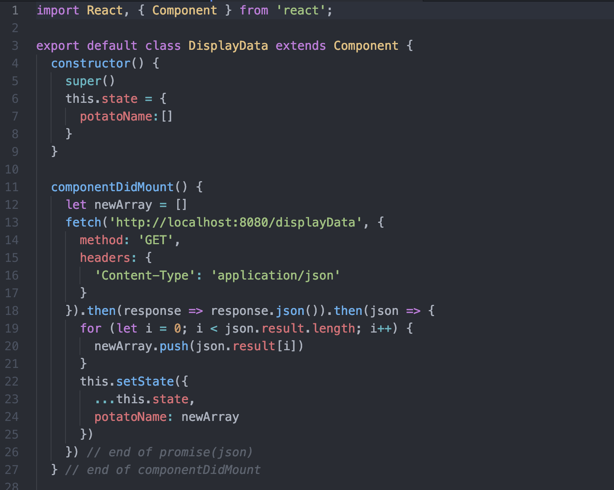

To simplify the tutorial, I am using **React Components** instead of **React Hooks**. This is simply so those who are newer to either coding as a whole or Sequelize will have an easier time understanding what I am doing.

```JavaScript
let newArray = []
    fetch('http://localhost:8080/displayData', {
      method: 'GET',
      headers: {
        'Content-Type': 'application/json'
      }
    }).then(response => response.json()).then(json => {
      for (let i = 0; i < json.result.length; i++) {
        newArray.push(json.result[i])
      }
      this.setState({
        ...this.state,
        potatoName: newArray
      })
    })
 ```

First, I create a **newArray** which will hold our **fetch results**. We **fetch** from our **localhost:8080**, which is where our backend server is **listening**. Our action is **/displayData**, which must be the same on the backend. With fetch, there are multiple methods we can use. Our client wants to **get** data, so we are using **method: 'GET'**. The header is to tell our browser the incoming content will be a **json file**.

After our fetch, we are using a **promise**. We take the response and run the **json()** function on it, which makes the response easier for us to use as a whole. Console.log(response) instead if you want to see all the data you receive during a fetch cal. Once we run the **json()** function, we take the new **json file** and iterate through it with a **for loop**. But why? Let's check our **developer tools** and **console.log(json)** instead of doing the for loop.

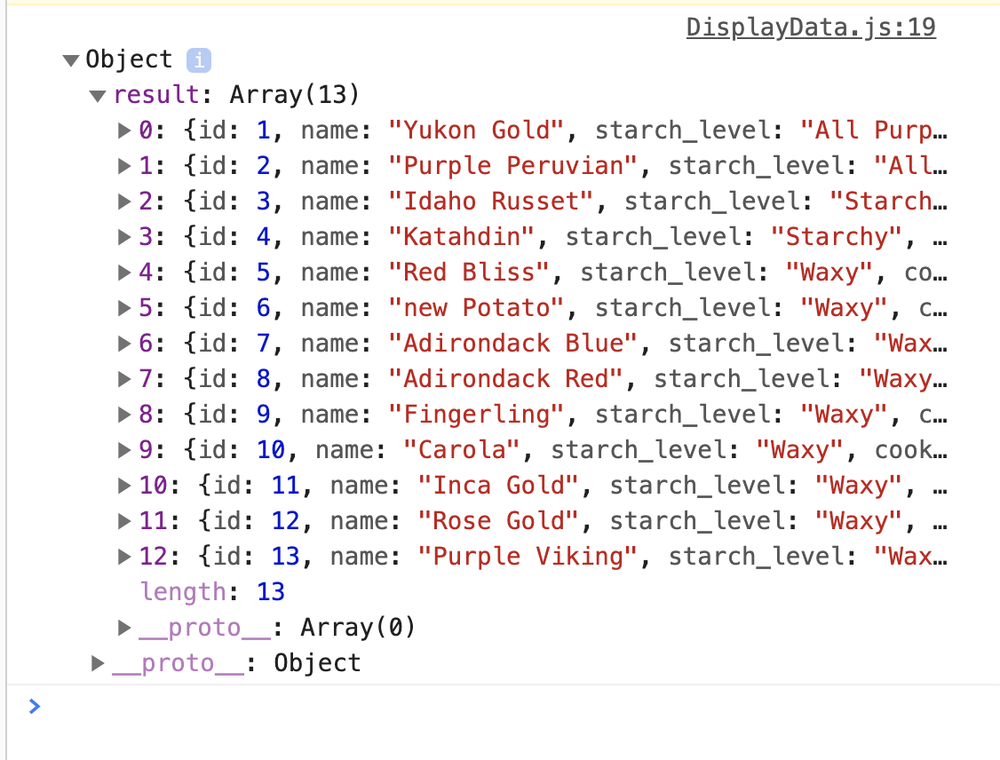

Our **json file** is an object, which holds an array, which holds objects, and those objects are our potatoes. **json.result** is how we get to our **result array**. **result** should look familiar since we sent the **result of our findAll()** to our frontend from our backend. Since result is an **array**, we must **iterate** through it to get **each result individually**. Using a **for loop**, we can **push each individual object within our array into our newArray**. With React, we must then set a state to use our data elsewhere. I have set the state of **potatoName** to be **newArray**. In more vanilla JavaScript, pushing the data into a newArray is likely all you need. This simply depends on the frameworks and libraries you are using.

We have the data on the frontend now, but we need to display it for our users. **NOTE:** Do not copy the following code without understanding it first, **ESPECIALLY** if you are not using React.

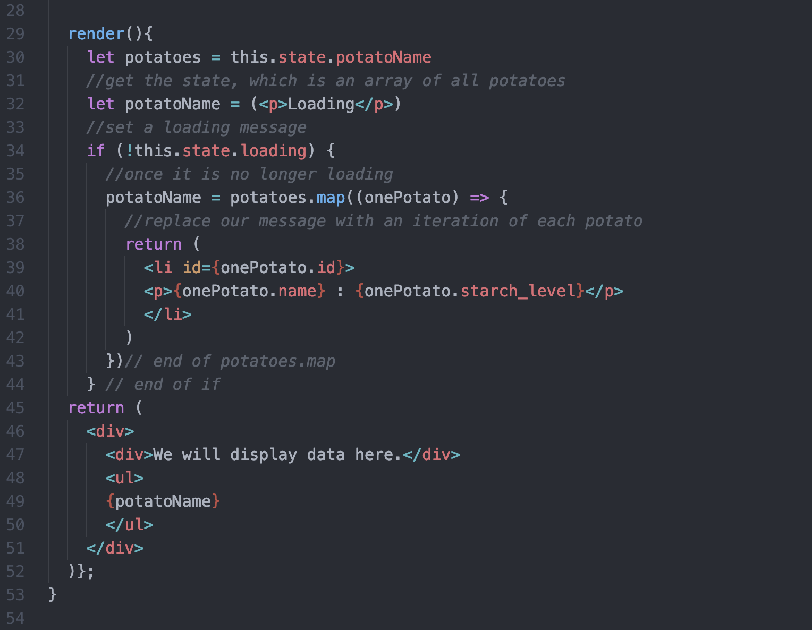

Since I set the state of **potatoName to be newArray**, this translates to **this.state.potatoName = newArray**. For those who are not React developers or do not use state, this essentially means I assigned a new global variable. I'm going to call said global variable **this.state.potatoName** and give it a shorter variable, **potatoes**. **potatoes** holds our **newArray**, which holds **all 13 potatoes** from our database.

```JavaScript
render(){
  let potatoes = this.state.potatoName
  let potatoName = (<p>Loading</p>)
  if (!this.state.loading) {
    potatoName = potatoes.map((onePotato) => {
      return (
        <li id={onePotato.id}>
        <p>{onePotato.name} : {onePotato.starch_level}</p>
        </li>
      )
  })
}
```

I am going to use a new variable **potatoName** in a dynamic way. Until the **fetch call** is completed, wherever we insert **potatoName** into our webpage there will be a **paragraph element** with the text **Loading**. My following **if statement** translates to, **"once the fetch call is finished updating my state, do this following code".** Again, do not just copy and paste expecting this to work if you are not using React.

Since I want to replace my **Loading** text once my **fetch call** is completed, I am going to assign **potatoName** to something new. **potatoes** was assigned to **this.state.potatoName** which was assigned to **newArray**. Essentially, **potatoes is newArray**. One way to iterate an array is using the **map()** function.

```
potatoes.map((onePotato) => {
  do something here
 })
 ```

Since **map()** says, **"do the following with each index inside this array"**, we assign a variable inside the **map()** function. **onePotato** is now a single potato, but it represents all 13 potatoes. Once **map()** is done with the first index of **onePotato**, **map()** runs again with the second index, then the third, and finishes on the 13th index.

Going back to our console log in our developer tools, we see each index is an object. Now we know **onePotato** is an object with the keys **id, name, starch_level, etc**. Look familiar? It should, since each key represents one column in our potatoes table. Since I want to display the name and starch levels of the potatoes for the user, I'm going to call the **name and starch_level**. **onePotato.name** will represent every potato's name, and **onePotato.starch_level** will represent every potato's starch level.

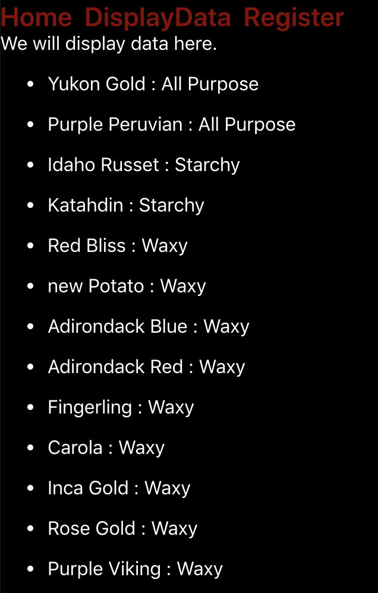

Our final result isn't pretty, since we really haven't done much styling, but we have successfully taken our potatoes from our database and displayed them for our users. In the next section, we will be combining **sorting** and **associations** by creating a **favorites list**, but first we will touch a very inportant topic. **Updating information.**

<br/>
<br/>

---

<br/>

<a name="user-update"></a>

<a href="#top">`back to top`</a>

How often do you find yourself going into your settings on a website and changing your profile information? Maybe you update your biography, change your name, change your email address, or your physical address. If you use a blog or review app, do you ever find yourself editing your comments? 

All of these come down to one concept: **updating data in your database.** With Sequelize, this is rather simple as we have access to anotherbuilt-in function, **update()**. Sequelize really likes to name stuff based on what it does, which makes using Sequelize more intuitive. How does **update()** work though?

```JavaScript
models.TABLE.update({
  column_1_to_update: value_1,
  column_2_to_update: value_2,
  column_nth: value_nth
  }, {
  where: {
    column_to_check: value_to_check_for
  }
})
```

First, you check your models for the **table** you wish you modify. For example, if you want to update your **user information** you would want to check the **user model**. The next part might not be as intuitive. First, **we tell Sequelize which columns we want to modify and what data we want the values to become**. Strange, right? We are telling Sequelize to modify data *before* telling it which entries we wish to modify. This is because **update()** takes in **arguments** first followed by an **options object**. The options tells our **update()** function **what to do** with our changes.

In our **options**, we can use **where**. This works the same as **findOne() and findAll()**. "Change the values of these columns where this column has this value." Or, in laymans terms, "I want to update my data. My username is XYZ." Our **option** can, of course, take in multiple values in the column. If we want to update a set of data, for instance every Toyota Corolla manufactured in 2019, we could specify that in our **where** argument. 

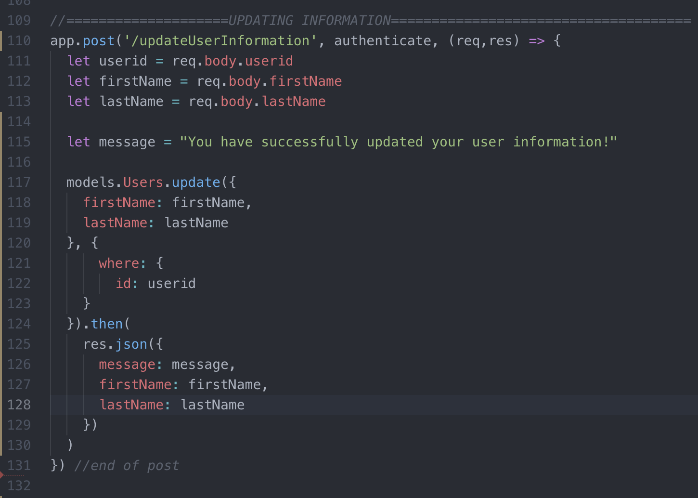

```JavaScript
models.Users.update({
  firstName: firstName,
  lastName: lastName
  }, {
  where: {
    id: userid
  }
})
```
When our client executes a **fetch** to our **/updateUserInformation** action, we take the information they wish to update and apply it to our Sequelize **update()** function. My thought process is fairly simple with how I build my backend action. First, I assign my variables to the information coming in. I then create messages based on pass/fail conditions. In this example, I am only setting one message for if we successfully update the user's information. In a fully developed application, you would want to catch errors and send responses if the update fails for whatever reason.

After assigning all my variables, I then want to run my **update()**. We declared models in the beginning ```const models = require('./models)```, our models has a model called Users, and we are using the Sequelize **update()** function. Remember, our models are our tables from our database. Since we are wanting the users to be able to update their user information, we are using models.Users. 

I build the **update()** function with the information I want to edit and which entries I want edited, in this case the first name and last name of the current user, I then send a response. The response is a confirmation that the update was successful. I also send the first name and last name to the frontend when it is successful, because I do not want the frontend handling the success response. The display will only change based on the information the backend sends, and the backend will only send the updated information if the update is successful.

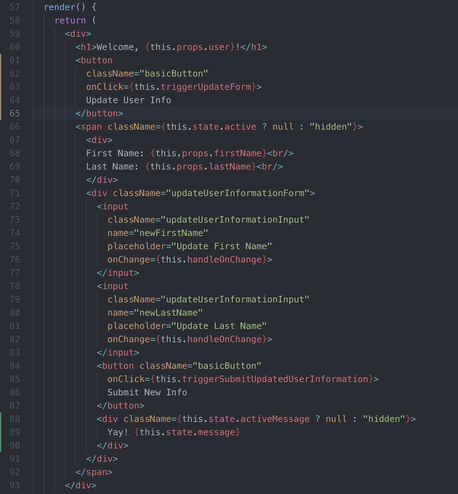

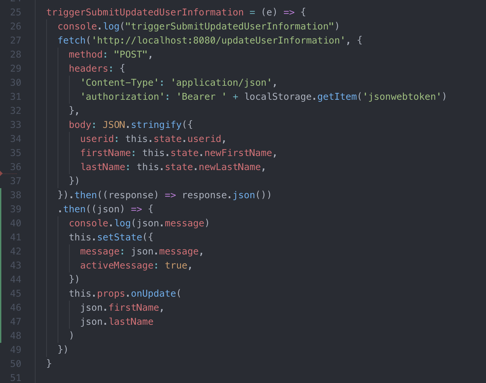

There is a lot going on, but the main thing to focus on right now are the inputs on lines 72 and 78 and the button on line 84. The button has an **onClick** called **triggerSubmitUpdatedUserInformation**. Great name, right? When the button triggers, it updates the user information. This function does a fetch call to our backend for the action **/updateUserInformation**, which we went over above. We want to **POST** our updated information to our database. We send our information through the **body** as **JSON.stringify()** since we are working with JSON. What we are sending in our JSON should look familiar; userid, firstName, lastName. If you look at the backend again, you will see we are assign variables to these values. Userid is req.body.userid, and so on. 

After sending our data, we use a **promise** (async/await works as well) to wait for a **response**. Our backend is sending a **response as a json**, so we turn our response into **response.json()**. We use another promise to take the **json** and do something with it. What I am doing is displaying the **json.message** on my webpage to inform the user **the update was successful**, then I'm updating the display with the **new first name and last name**. **NOTE:** Knowing the language and tools you are using is important, as I am using React and Redux to update my display. The way you update your display may be different from the way I updated my display.

Let's look at our functionality in action.


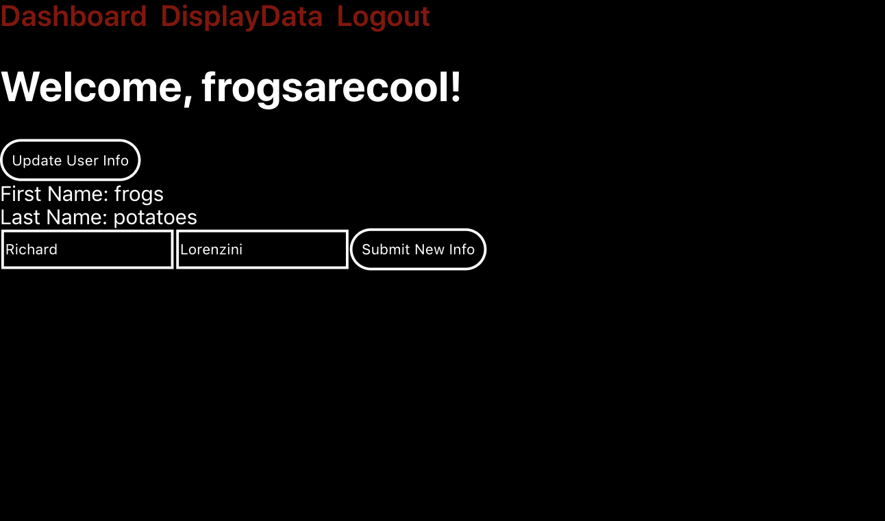 

As we see, my first name is "frogs" and last name is "potatoes". I want to change my information to my actual first name and last name, Richard Lorenzini. I fill out my form and get ready to update my information.

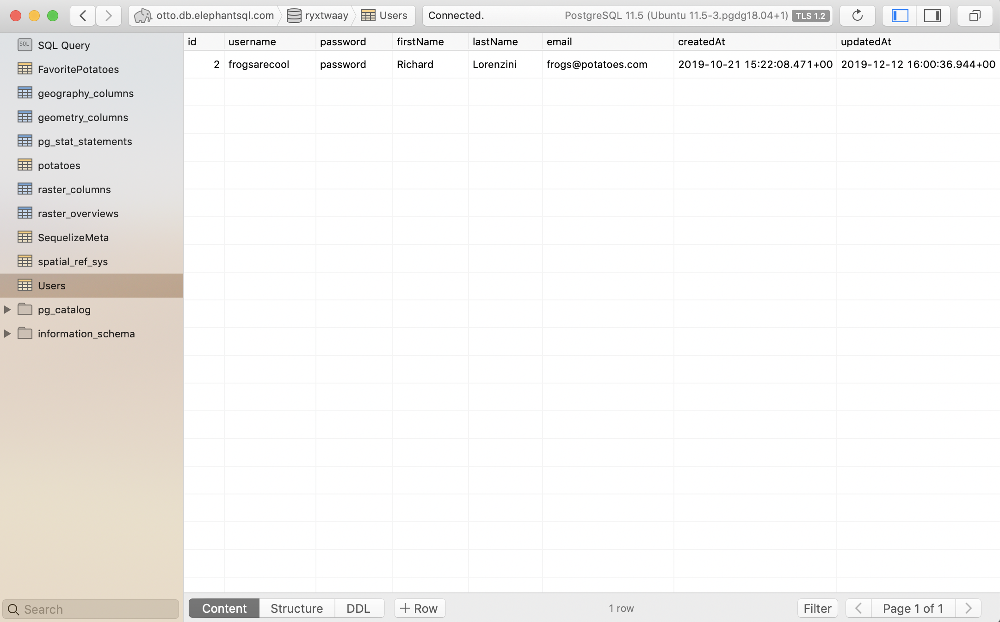

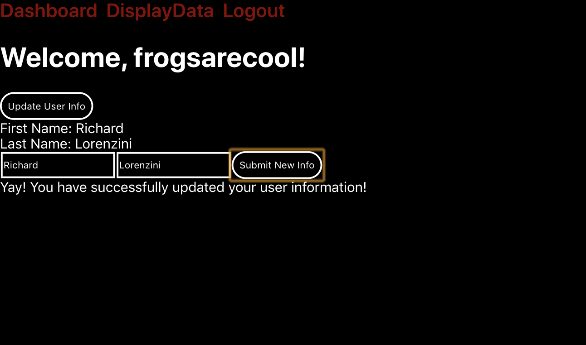

Both in postico and on our application's user interface we see the information has been updated. **NOTE:** remember you must refresh postico to see these changes take effect. Our UI is set up as a single page application and will show us the changes automatically. 

Now that we can update basic information, let's dive into associations!

<br/>
<br/>

---

<br/>

<a name="associations"></a>

**The bread and butter of any database**

<a href="#top">`back to top`</a>

**Associations** are the backbone of all data. You can collect data. You can display data. You can manipulate data. These are very important, but data doesn't exist to just sit in one spot without reference to anything else. There are endless combinations to explain associations and their importance, as we will see below.

**How do I know *WHEN* I need an association and *WHY* I need an association?**

1. Bryan Abreu is a **pitcher** for the **Houston Astros**, which is a **Major League Baseball** team. Bryan is *associated* with being a pitcher, being *a pitcher for* the Astros, and the Astros are *associated* with baseball.

2. Daniel Radcliffe is an **actor** who is known for **his role** as **Harry Potter** in the **Harry Potter movie series**. Daniel is *associated for his profession* as an actor, is *associated with his role* as Harry Potter, and Harry Potter is *associated* with being a *movie*, being a *movie series*, being a *movie series adapted from a book series*, and for being in the *fantasy genre*.

3. Rose Gold is a **waxy potato**. Rose Gold is *associated* with being a *type of potato*, a *vegetable*, and for being a *waxy potato*.

I'm sure most people can think of a dozen associations off the top of their head. Your database is **very limited** if you do not use associations. Without associations, how would you look up car parts, store a favorites list, have a friends list, or even a comment section in a blog? **NOTE:** it is *possible* but *not practical* to do this without associations. You database will quickly get bloated due to repetitive data. For example, a car dealership would have to build every single car from scratch. If there are two 2015 Toyota Corollas which are exactly identical *except for their VIN number*, you would have to *build both cars from scratch*. With associations, you can say, "This Corolla is associated with these parts, but has its own unique VIN number." Now, we have reduced the amount of data we have to store **by half**. There are millions of cars in the USA alone, all of which have unique VIN numbers. By using associations, we only have to list each car part *once* and tell each car to *associate* with those specific parts. Otherwise, we would be building *millions* of cars in our database.

This is just an example, but let's look at associations in use.

## Types of Associations

<a name="one-to-many"></a>


<a href="#top">`back to top`</a>

### hasMany, belongsToMany

**hasMany and belongsToMany** are the two ways to do a **One to Many Association**, but what does this even mean? When we do an One to Many Association, we are declaring, "this one **item** can refer to **multiple things**." For instance, looking at our potato database we can see a *potato* can **refer to many** different *types* of potatoes. As with our previous examples, a player can be associated with one team, or if they have a long career multiple teams. Also, one actor or actress can be associated with many films, and one film can be associated with many actors and actresses.

**NOTE:** As stated previously, I am using **React and Javascript** on my frontend and **Node, Express, and Javascript** on my backend. In order to do more complex things with my frontend, such as protecting routes with authentication, using Higher Order Components, and storing global state, I am now using **Redux and React Redux**. This is where knowing the language you are coding in is important, since **Sequelize** cannot substitute frontend knowledge.

### hasMany

**hasMany** is the first association we will be working with, because reasons. Do you want to know my reasoning? Well, my reasoning **has many** reasons. First, I find it easy to work with, especially as a newcomer. Second, in **MY OPINION** it has the most utility. Third, it's the one I have used the most and know the best.

As always, we must start with the CLI (command-line interface) to create a new migration. Remember, Sequelize is built on migrations and stores a log of each migration it ran and when. Skipping this step will not immediately destroy your app, but if you ever have to relaunch or rebuild your app it will fail to build your Sequelize properly.

```console
sequelize migration:create --name add-fav-potato-association-table
```

Inside of our new migration, we are going to build our new table **improperly**. I am doing this on purpose, so we can see potential issues and how to fix them. Before scrolling past the picture to look at the solution, see if you can find the error yourself. If you cannot, do not fret! I will be explaining what I did wrong **and** how to fix it. With this migration, I want to build a **favorite potatoes** table with the **userid** and **potatoid**. I will explain why further down, but for now try and find the error.

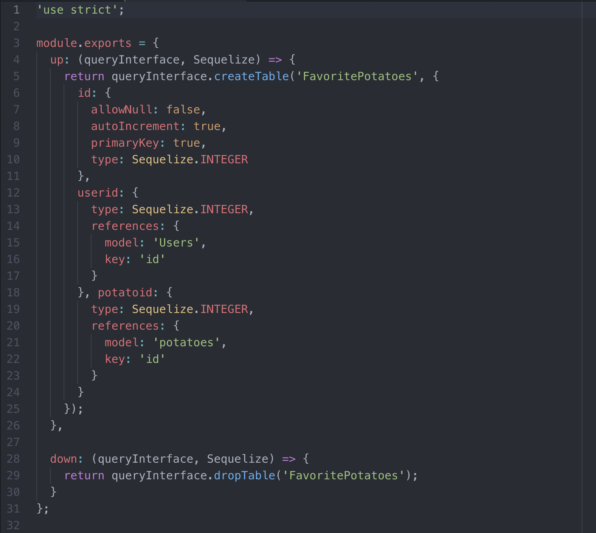

```console
sequelize db:migrate
```

Do not forget we must migrate for our migration to be applied. This will not fail to run because the code itself is fine. Also, remember that Sequelize does not build our models for us after our initial build. We will have to add our own favorite potatoes model.


The part I intentially built wrong was not including **createdAt and updatedAt** in my migration. The error message, when you try to build an entry in this table, will say something about one or both of these **not existing**. Our model itself is not wrong and will work properly, because Sequelize **does not require** us to have createdAt and updatedAt inside of our model, but they **must exist inside our table on our database**. The only way for us to get them to the database is via a migration. **If you do this inside your databse directly and not via migrations, Sequelize will not build properly if you pull your project at a later time.** Doing each step is very important! The only thing Sequelize automatically creates for **every** migration we create is the **ID**, and **only if** we are running the createTable function. Even though Sequelize automatically tracks the date of each row's creation and last update, we still must build those columns inside our migration.

In order to fix this mistake, which is very easy to do when you run in autopilot, we need to run a new migration.

```console
sequelize migration:create --name add-dates-to-favorite-potatoes
```


```console
sequelize db:migrate
```

Now our table has both createdAt and updatedAt, meaning Sequelize will now be happy. Since we have to create multiple columns, we must wrap it inside of **Promise.all([])**. Sequelize's migrations can only return **one instance**, which is why we make our one instance **Promise.all([])**. This is how we handle doing multiple things within one migration. Building a table, no matter how many columns it has, is considered one action and returns once. If we were to build two tables within one migration, we would have to use Promise.all([]).

**Why do we have a new table for our favorites?**

This method aims to resolve a few issues. Associating two tables directly can get quite mess, mostly due to how **DataTypes** work with databases and Sequelize. For instance, the easiest way to associate to an item is based on the **unique ID** of that item. **Only** that item has that ID. As a user, I want to favorite **multiple** potatoes. Can **DataTypes.INTEGER** hold a sequence of numbers? No. **DataTypes.STRING** can, but it is not longer an **INTEGER** which directly associates to a potato's **unique ID**. We would have to create a function to take the **STRING** and split it into multiple **INTEGERS**, and then create a function which uses **findOne** on each **INTEGER** we have. This is extemely cumbersome and will slow down your server immensely!

By creating a new table which holds both the **userid** and **potatoid**, we only have to reference that table and **findAll** where the **userid** matches our current user. Now, we have every **potatoid** which is **ASSOCIATED WITH** our user.

### UPDATE YOUR MODELS WITH ASSOCIATIONS

There are a lot of steps, which makes missing one or two very easy, but they are all important. Updating our **user and potato models** is one of those steps. We want to tell Sequelize, "this user/potato will be associated with many favorites". **NOTE:** Remember, I did not use typical naming conventions. Also, Users is capitalized which potatoes is not. This is to show new users of Sequelize naming conventions are **NOT** mandatory, even though they are recommended. **Use the naming convention your job demands**, or whichever naming convention you prefer.

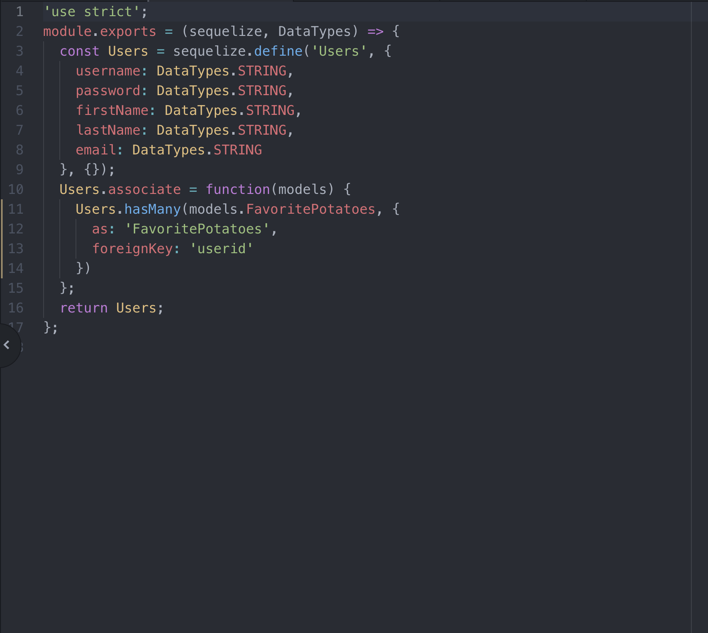


```JavaScript
CurrentTable.hasMany(models.AssociatedModel, {
  as: "AssociatedTable",
  foreignKey: "AssociatedColumnFromAssociationTable"
})
```

For simplicity, I keep variables very similar. My favorites table has a userid, and my user table has an id. This can get confusing, so I wrote out how I understand the Sequelize associations model. We are telling our **current table**, which is either our **users or potatoes table**, it is going to **have many associations**. These associations are going to be with another **model**, which I labeled **AssociatedModel**. In our example, this is our **FavoritePotaotes** model. **hasMany** takes in options are the model, with **as: and foreignKey:** being the two options I use most often.

**as:** checked our database for the **Associated Table** we are associating with. Since I like to keep variables similar if they represent the same thing, **my model and table are both called FavoritePotatoes**. This is purely because named them as such. Our **foreignKey:** is looking inside of our **Associated Table** for a specific **column**. This column has been called **userid**, because our **FavoritePotatoes** needs to know the **ID of the user** that has favorited a specific potato.

This is a lot to digest, so if you are getting lost take a five minute break and come back.

### Frontend

Let us look at how we would create a new entry in our favorites tables. Our user is logged into our application and is interested in our selection of potatoes. They wish to save a few potatoes to their favorites. As with most any website, this is most commonly a **single click**. I have built our **displayData.js** file again, but this time it is **protected by authentication**. When you are not logged in, you simply see the potato data. When you are logged in, you now see an option to **favorite a potato**. I have named this file **userDisplayData.js**.

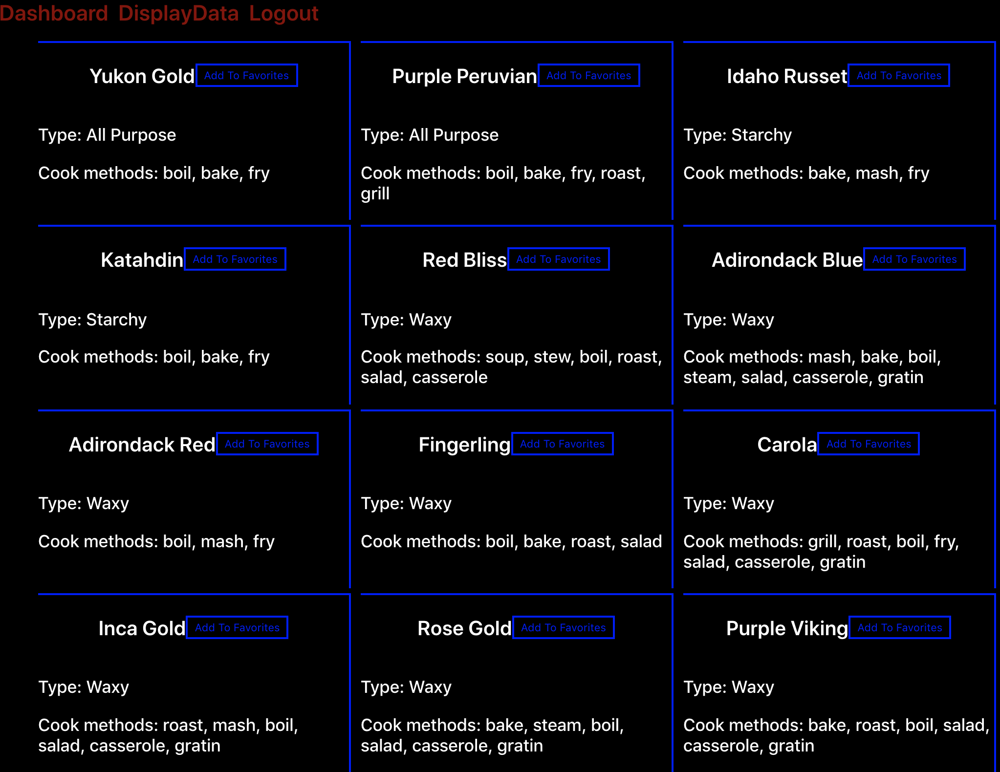

Our UI looks almost exactly the same, and the *mostly* the same as well. We only need to add a new **post fetch request and button**.


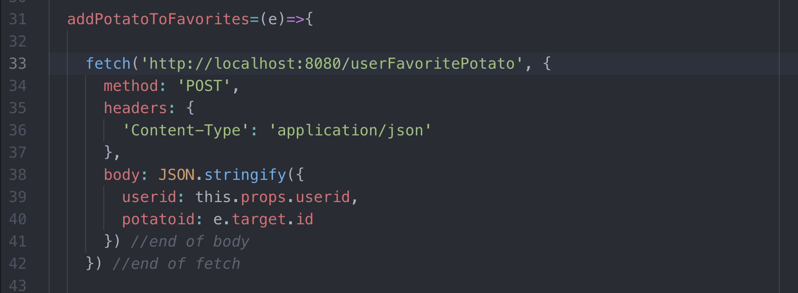

```JavaScript
<button className='favoriteButton'
  id={onePotato.id}
  value="false"
  onClick={this.addPotatoToFavorites}>Add To Favorites
</button>
```

Our new button has a few properties. For now, ignore the **VALUE="false"** property. This is purely for styling test purposes and is **not used** in relation to Sequelize. What we need to focus on is our **onClick** property, which calls the **addPotatoToFavorites** function. **addPotatoToFavorites** creates a **post fetch request** which is sending a **JSON file**. This JSON file includes a **body** with two keys; **userid and potatoid**. This function uses **React Redux** to send the **userid** to our backend. You can use local storage to store the **userid**, but I chose to use **React Redux** moving forward. **e.target.id** is used to take the **potatoid** from the button, which is why our button has a value **id={onePotato.id}**. Since each button is unique and each have a unique event instance, we can directly pull a single ID from the button which is triggering the onclick event.

```JavaScript
addPotatoToFavorites=(e)=>{
  fetch('http://localhost:8080/userFavoritePotato', {
    method: 'POST',
    headers: {
      'Content-Type': 'application/json'
    },
    body: JSON.stringify({
      userid: this.props.userid,
      potatoid: e.target.id
    })
  })
}
```

As you can see, in order to store a new **favorite potato** we are only sending **TWO INTEGERS** to our backend. If we did not create our favorites table and did not use associations, we would have to rebuild our **user** with the entirety of **every favorited potato**. Maybe you could have a **DataTypes.STRING** which you split and then append a new string to an array before combining it back into a string and modifying our data entry. What data would you include in your new column? Even if you only store the name, you'll have to split your string and run a **findOne** for each potato name. Again, this is just not efficient and can get confusing very fast.

### Backend

Let's check out what our backend is doing with our new favorites.


Associations sound and look intimidating, but so far we have only added a few lines of code between our frontend and backend. The backend checks for the **body**, which we sent in our **addPotatoToFavorites** function. As we have done before, we are going to build a new entry in a table. For learning purposes, instead of using **build** I am going to use **create**. The only difference is with **build** you must **save()** your model, whereas **create** runs **save** automatically.

```JavaScript
app.post('/userFavoritePotato', (req,res) => {
  let userid = req.body.userid
  let potatoid = Number(req.body.potatoid)

  models.FavoritePotatoes.create({
    userid: userid,
    potatoid: potatoid
  });
});

```

Whichever potato we click to favorite sends **req.body.userid** and **req.body.potatoid** to our backend. Our backend takes those values and sends them to our **FavoritePotatoes** table. **NOTE:** This is where you would experience the error I explained earlier if you build your migration improperly. To make sure everything worked properly, let us check our database with Postico.

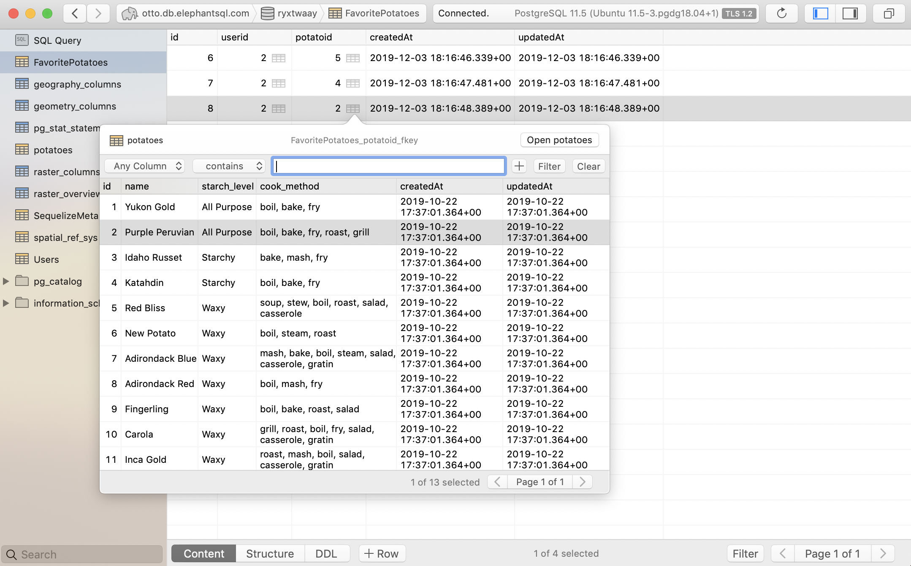

Every single favorite is its own entry in our database. Our user, who's **unique ID** is 2, has favorited **three separate potatoes**. **NOTE:** We cannot currently check if an entry already exists, since we have not written the code to do such. Therefore, a user can currently favorite the same potato multiple times. Try thinking of different ways to protect our user from making this mistake and how you would develop it in your code.

<a name="one-to-one"></a>


<a href="#top">`back to top`</a>

### belongsTo, hasOne

<a name="many-to-many"></a>

### hasMany


# FUTURE UPDATES
<a href="#top">`back to top`</a>

_(maybe?)_

**findOne, findAll, destroy, build, findByPk, update**

models.TableName.<insert_here>({})

findOne({ where: { attribute: desiredValue } })

findAll({ where: { attribute: desiredValue } })
findAll({ }) returns all from whichever Table you declare

destroy({ where: { attribute: desiredValue } })
destroy({ }) can be used in various ways to destroy empty data, tables, etc
destroy({ where: {} }) destroys all data in a table
destroy({ where: {}, truncate: true })

build({ attribute: desiredValue }) needs the required attributes at minimum

modify entries
