# SEQUELIZE TUTORIAL FOR BEGINNERS

**Created By:**

```{ Name: "Richard Lorenzini" }``` <br/>
**THIS IS A WORK IN PROGRESS**

| SEARCH OPTIONS | WHAT IT'S FOR |
| :--- | :--- |
| DOC#START | BEGINNING OF DOCUMENTATION |
| SQLZ#START | SETTING UP FROM SCRATCH |
| SQLZ#NPM | SEQUELIZE INSTALLATION |
| SQLZ#DB | SETTING UP THE DATABASE |
| SQLZ#MIG | FIRST MIGRATION |
| SQLZ#FORMS | FORMS AND POSTS |

# AND SO IT BEGINS

**DOC#START**

**Sequelize** is a tool used to make the connection between your *backend* and your *database* simpler. Setting up Sequelize and understand what is going on can be daunting, so I hope this simple and basic tutorial helps anyone who reads it. This tutorial is **VERY BASIC** and will not go into great depth about every aspect of Sequelize.

## Setting Up

**SQLZ#START**

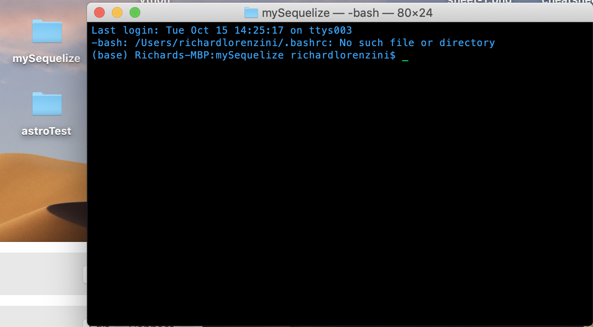 

I have created a new folder called mySequelize and opened a terminal at that folder.

My terminal is displaying the following, indicating I am on my Macbook Pro, in the folder 'mySequelize', as user: richardlorenzini.

```console
(base) Richards-MBP:mySequelize richardlorenzini$
```

## Setting Up Git

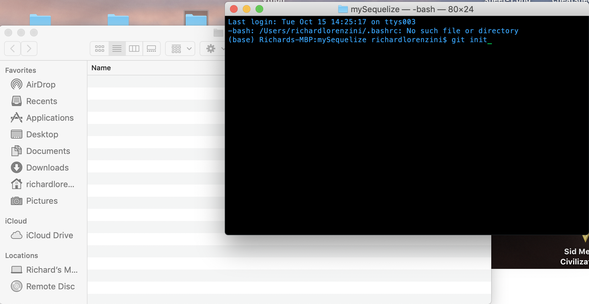 

```console
git init
``` 

We will begin by initializing our git folder and connecting to this git repository.

 

```console
git add remote origin <insert_repository_url_here>
```

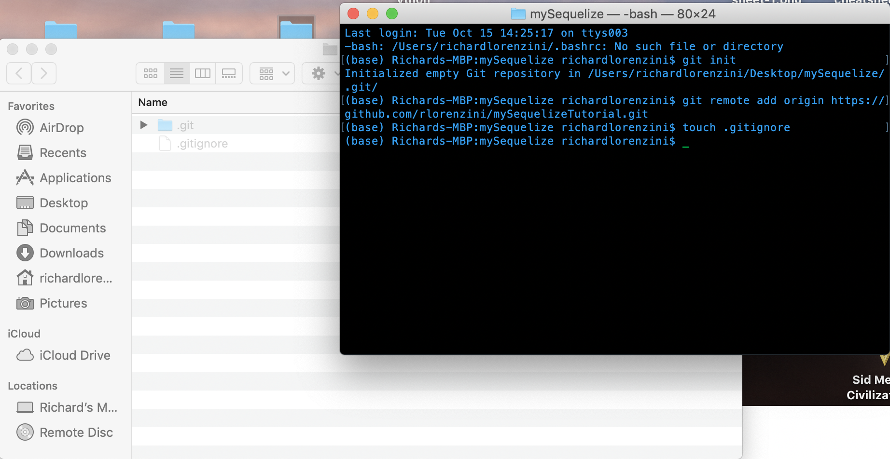 

```console
touch .gitignore
```

.gitignore is used to tell your git commands to ignore certain folders. This is extremely useful when working in a Node.js environment, as your Node_Modules folder (the packages installed into your project) can get massive quickly.

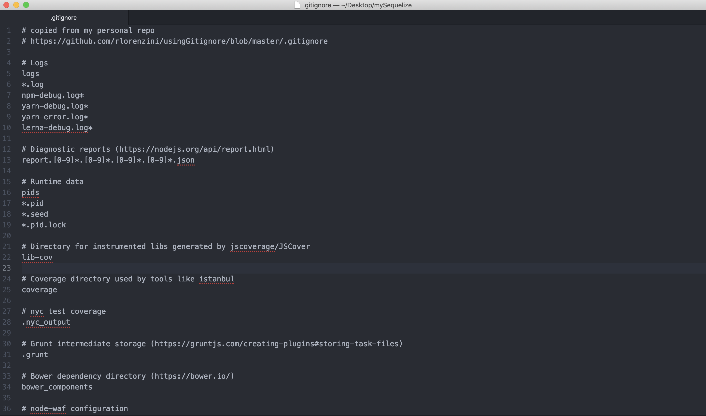 

My .gitignore file can be located in my GitHub repository <a href='https://github.com/rlorenzini/usingGitignore/blob/master/.gitignore'>HERE</a>. This is a cookie-cutter catch-all .gitignore file. 

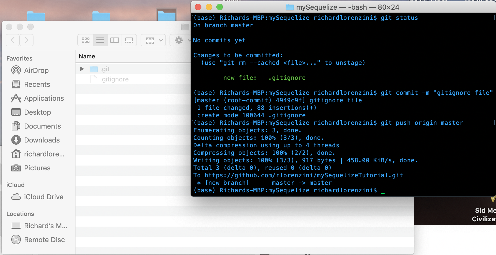 

```console
git add . && git commit -m "first commit" && git push origin master
``` 

I always perform an initial commit to verify I have properly setup my git environment.

# NPM TIME

**SQLZ#NPM**

 

```console
npm install express && npm install cors && npm install body-parser && npm install sequelize && npm install sequelize pg
```

I install **express** to make my time coding my backend simpler, **cors** is to avoid certain HTTP request issues, **body-parser** allows us to translate what is being sent from the frontend to the backend, **sequelize** is the point of this tutorial and makes the transfer of data from the backend to our database simpler, and **sequelize pg** is used to tell sequelize we are using a *postgres database*.

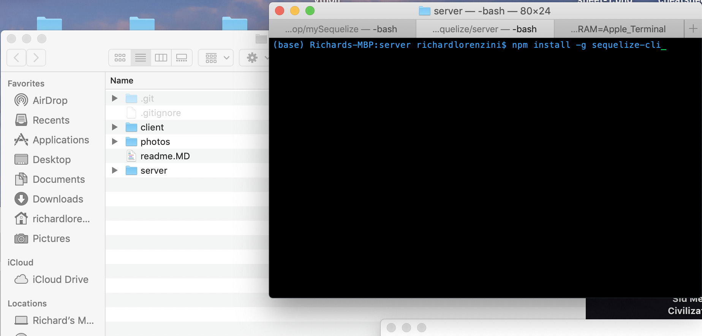 

```console
npm install -g sequelize-cli
```

Sequelize does not, by default, have a command-line interface. **Sequelize CLI** literally stands for "Sequelize Command-Line Interface". We are installing this so we can avoid a lot of the file creating and editing Sequelize performs. This also makes migrations easier.

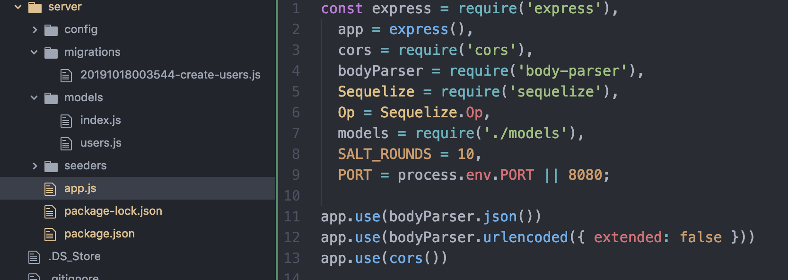 

Setting up our backend **app.js** environment. What we installed, we are requiring. 

**NOTE:** 
```console
models = require(./models)
``` 
is so we can tell Sequelize where the models are. More on that later.

## Database Setup

**SQLZ#DB**

In your command-line, which should be in your directory for your backend (the folder which has **app.js**), run the following command. 

```console
sequelize init
```

We have now initialize Sequelize. If you receive an error message informing you Sequelize is not a command, you did not properly install the Sequelize-CLI. 

Sequelize will create several folders inside of your working directory: models; seeders; migrations; config. At this point, running 
```console
sequelize db:migrate
``` 
can help avoid any early-stage issues, but is not required.

| FOLDER | QUICK EXPLANATION |
| :--- | :--- |
| MODELS | A visual representation of each table in your database. Does not always update with migration. |
| MIGRATIONS | JavaScript files which execute during migration. These files are the backbone of Sequelize. |
| SEEDERS | Used to dump data into a table. DO NOT USE in place of forms, post, and create/build. |
| SEEDERS | Seeders should not be used until you have a deeper understanding of Sequelize. |
| CONFIG | The config file in this folder tells Sequelize what database you are using and where it is located. |

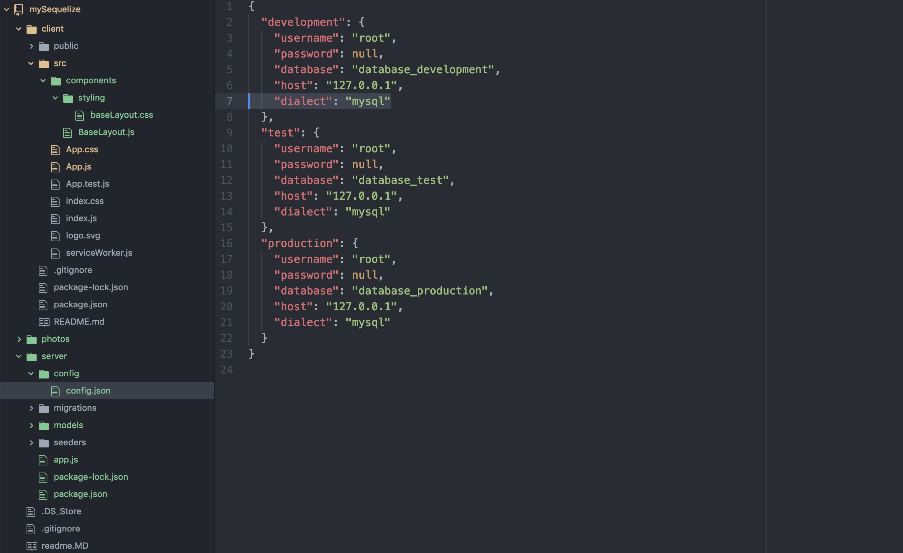 

The config file will very likely need modified from the beginning of your project. For example, unless your database is a MySQL database, you will need to change your dialect. In our case, we are going to change the dialect to **postgres** since we are using a postgres database. 

I prefer to setup a database on a website called **ElephantSQL**. It is a free online service to host a database and store the data. ElephantSQL **DOES NOT** replace Postico and **DOES NOT** show you the tables, columns, and data inside of your database.

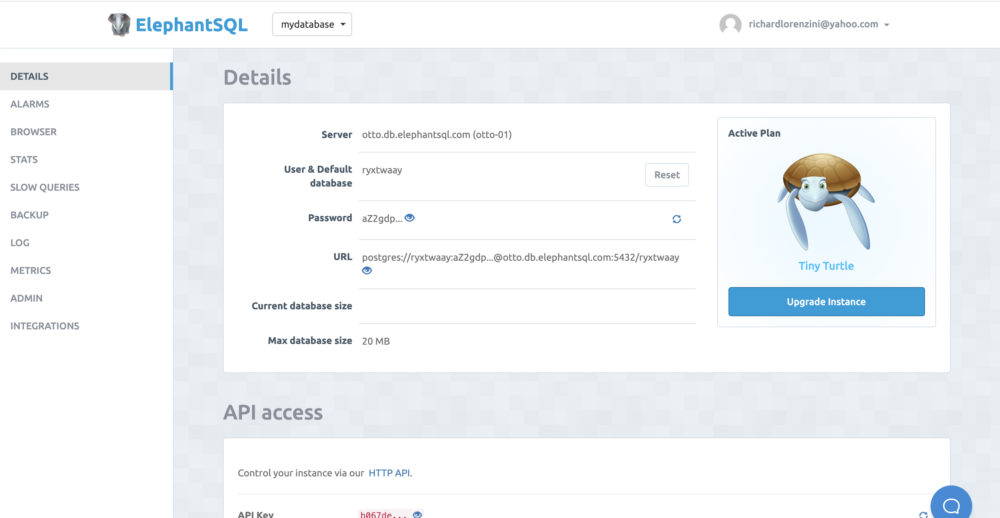 

ElephantSQL provides us several pieces of information, which is automatically generated when we create our database. What we are interested in is **Server, User & Database, and Password**.

| SERVER | The URL our database will be hosted on. A local environment runs a database on PORT 5432 by default. |
| USER/DATABASE | When we go to our server, this is our username and the database name we are looking for. |
| PASSWORD | The password we need to access the DATABASE via our USER. |


The placement of the information into postico and your config file are straight forward. 

SERVER goes into "host", USER & DATABASE goes into "username"/USER and "database", and PASSWORD goes into "password".


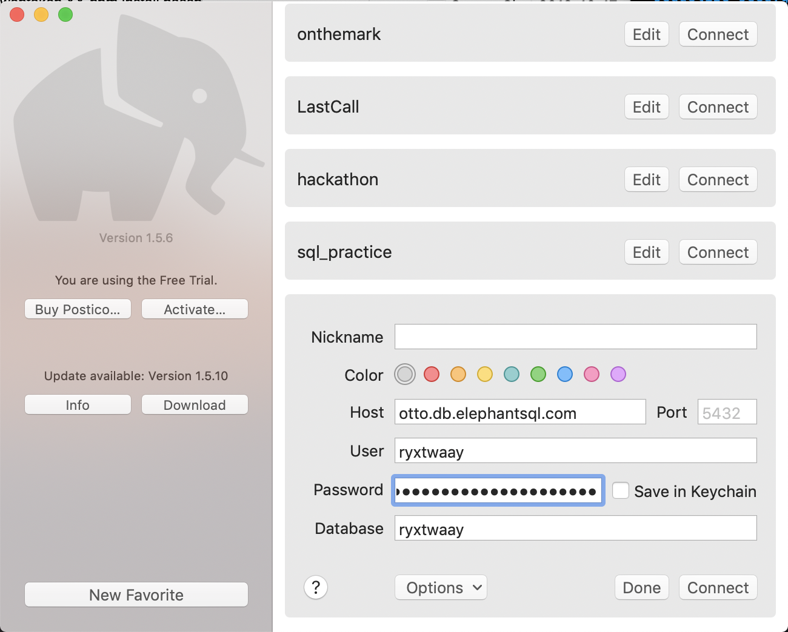 

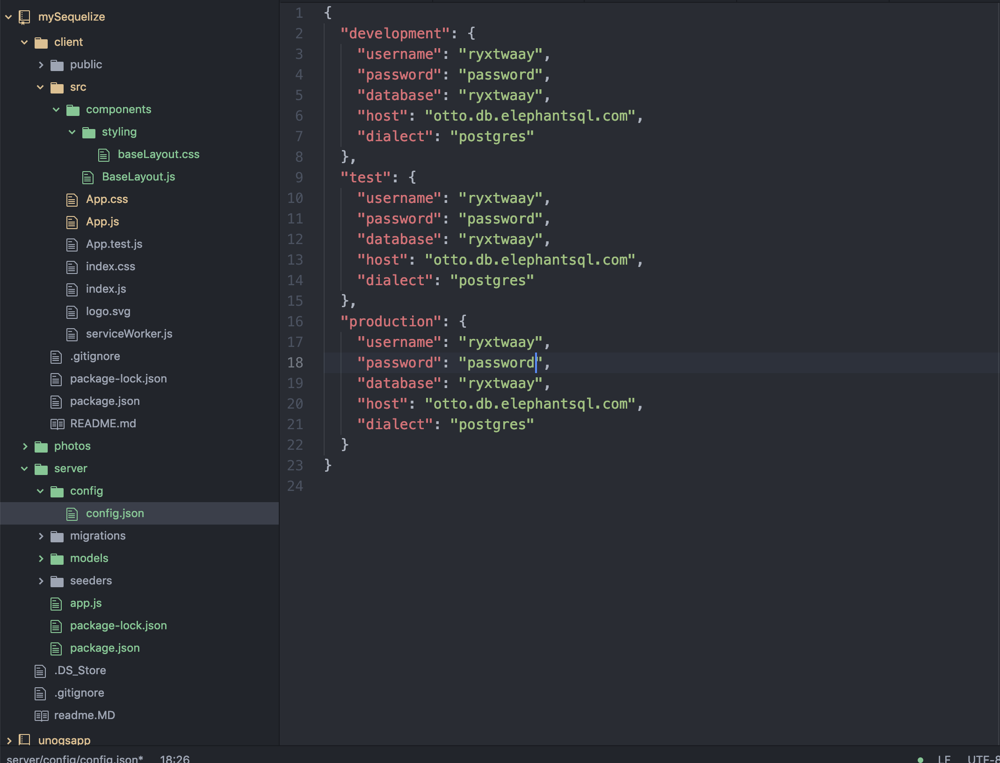 

# FIRST MIGRATION

**SQLZ#MIG**

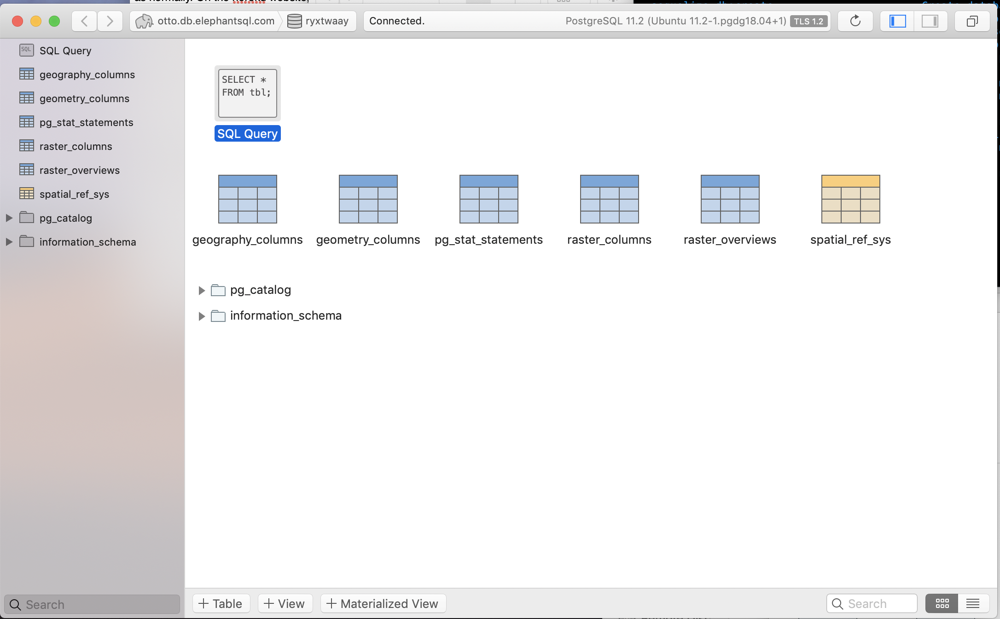 

Once we connect into our database via Postico, we can see all of our tables, columns, and data is a clean interface. Our Postico database is practically empty at this stage, as we have no created any tables.

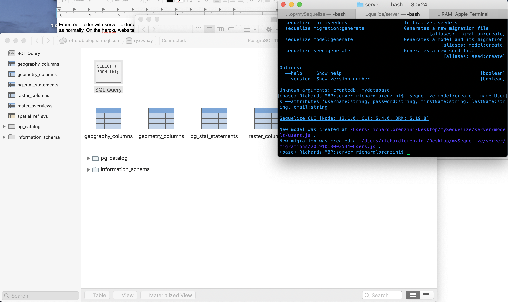 

```console
sequelize model:create --name Users --attributes 'username:string, password:string, firstName:string, lastName:string, email:string'
```

We are finally creating our first **TABLE**. A *table* in Sequelize is referred to as a **MODEL** and *columns* are **ATTRIBUTES**. Our 
```console
model:create
``` 
command takes in a name and attributes. The name must be declared as 
```console
--name NameOfYourTable
```
. You **MUST** delcare --name or the command will fail. Columns are immediately declared after the name of the table, and must be declared with --attributes to work. Attributes are wrapped inside of apostrophes as a whole and not individually, so be mindful of your syntax.

```console
--attributes 'FirstColumnName:DATATYPE, SecondColumnName:DATA, etc:etc'
``` 

 

Running our model:create command has generated a new migration file. Migration files are JavaScript files with JavaScript code. Essentially, in our migration file above, we are creating a Class via Sequelize. This file is executed when we run 
```console
sequelize db:migrate
```
This particular migration file is telling us it will create a table called Users with the attributes id, username, password, firstName, lastName, email, createdAt, and updatedAt. Id, createdAt, and updatedAt are automatically generated by Sequelize. 

Our migration file starts with 
```console
model.exports
```
which is an object. The first key for our object is UP, and the last key is DOWN. Both UP and DOWN need to be utilized in a specific manner.


| UP | Used to create, modify, or update your database. |
| DOWN | Used to delete, undo, or reverse whatever UP does. |

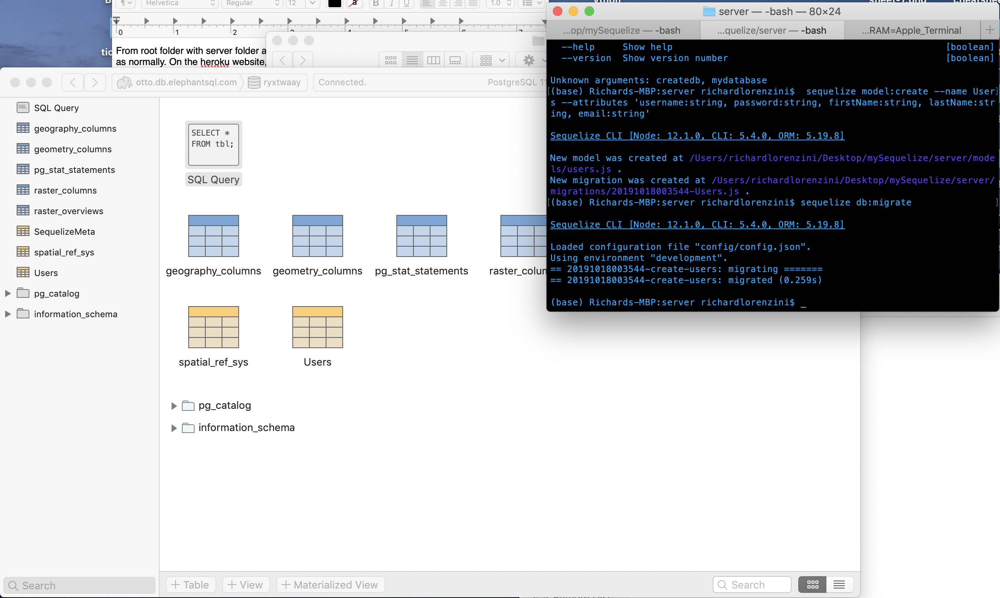 

I'm going to slow down and explain a bit about Sequelize, as to understand db:migrate we must understand how Sequelize functions. Sequelize keeps a log of everything done. Every migration is kept, with a log of when what was ran. This way, if a new user pulls our project and runs our project, Sequelize can build the environment from scratch exactly how you, the original developer, built your project. Due to this, you **must** commit fully to Sequelize. Let me explain.

Imagine following this tutorial and at this point <GO TO JACLYN'S GITHUB FOR THIS INFORMATION> would be great, right? But we really don't talk about that anymore, especially after **the incident**... Anyway. Let's move on to utilizing Sequelize with scrapping data form news websites.


I'm only partially kidding, but this is essentially what happens when you do not commit fully to Sequelize. If you use pg-promise to create a new table, Sequelize will be unable to retrieve that script and build a proper environment. Then, the user who downloaded and ran your project will not have a fully functional environment.

Say you created a Users table in pg-promise. If the user then goes to a *login page* you created and submits their login information, your application will crash due to being unable to communicate properly with the server. Sequelize does not know the Users table exists since it did not create a migration and execute building the Users table. This is why if you plan to use Sequelize it is **HIGHLY** recommended, and almost completely required, to **ONLY** utilize Sequelize.

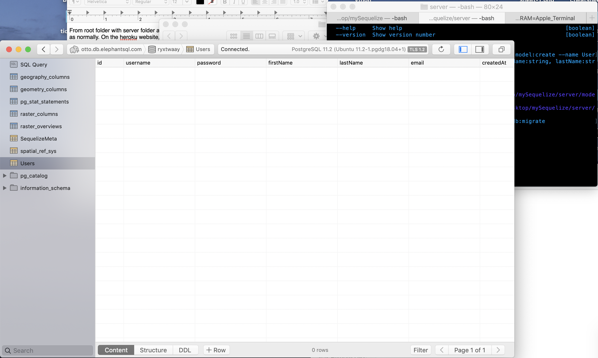 

Looking at our Postico after our db:migrate, we can see our Users table and the columns we specified. **MAGNIFICENT.**

# FORMS AND POSTS

**SQLZ#FORMS**

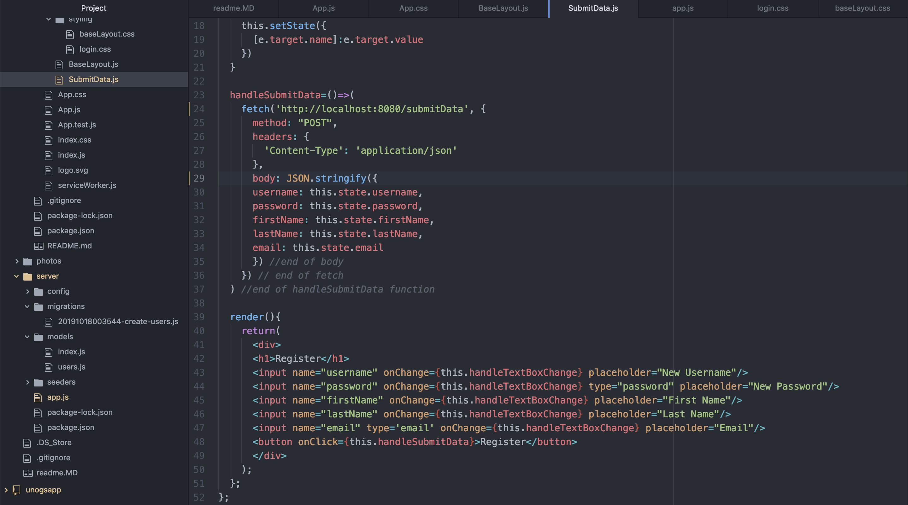 

fetch, form, post, inputs, etc
NOTE: forgot picture of backend console.log(req.body), must explain manually

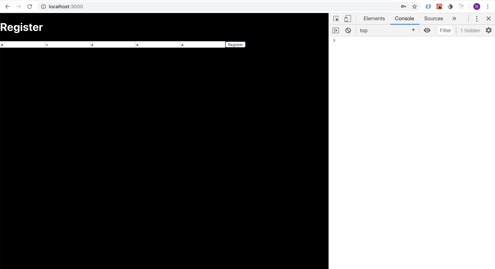 

ugly website

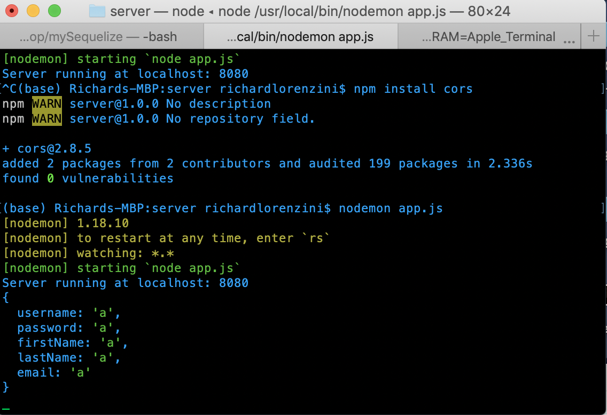 

how req.body comes to us in terminal 

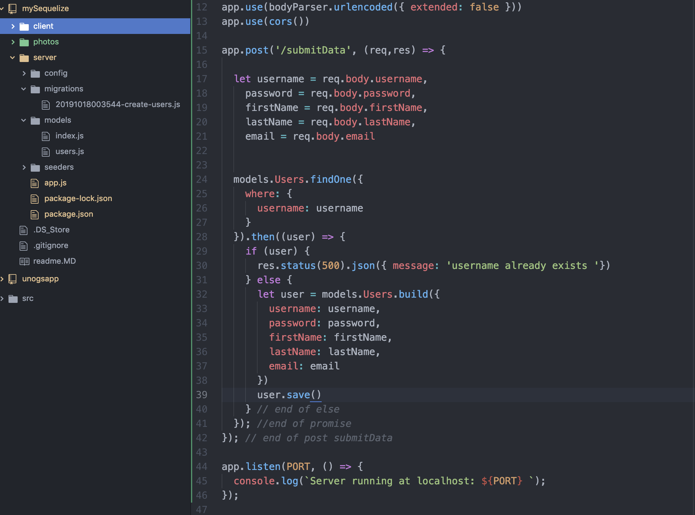 

explain the app.js code 

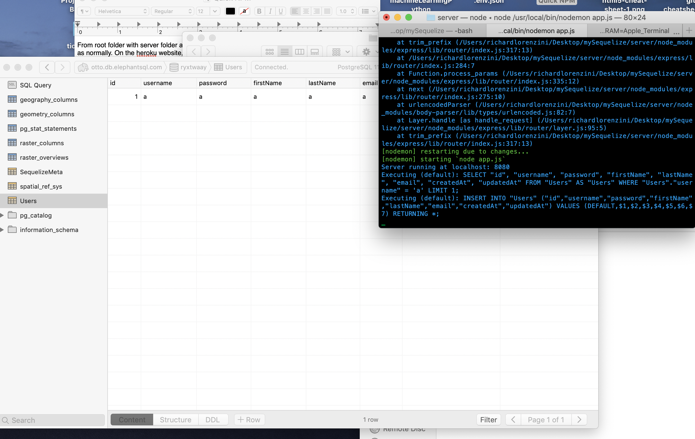 

explain the results 
